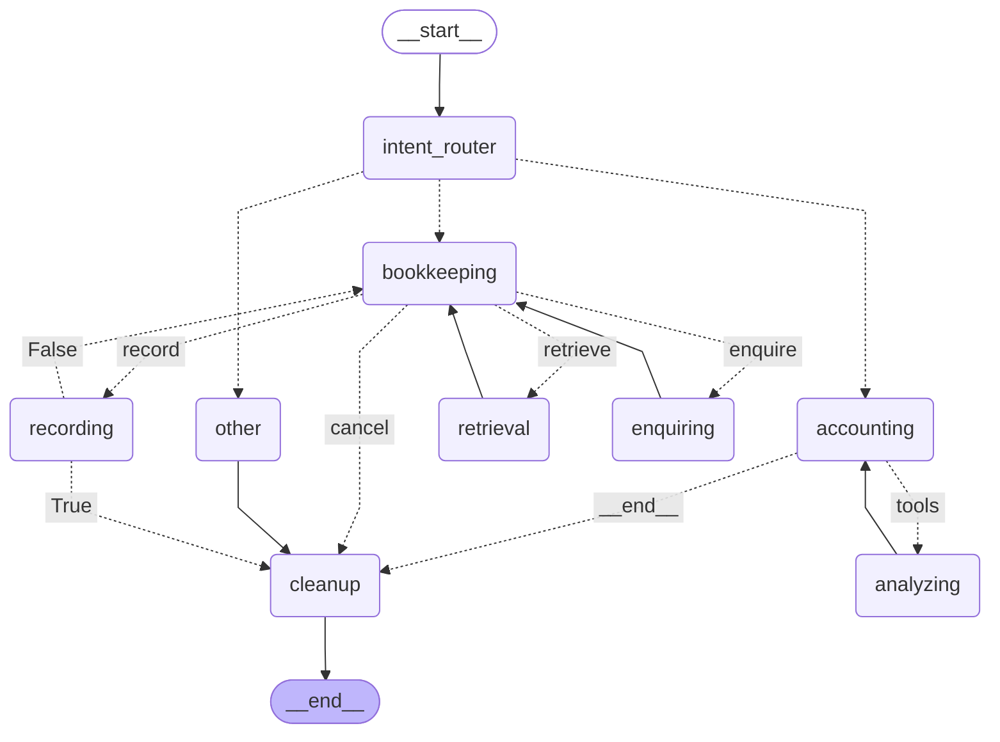

# beancountant

A personal finance [Telegram](https://telegram.org/) bot built for [Beancount](https://github.com/beancount/beancount/), a double-entry bookkeeping computer language.

Powered by [LangGraph](https://www.langchain.com/langgraph) and LLMs, it acts as your personal accountant, allowing you to record transactions and analyze your finances through natural language over Telegram.

## Features

- **Natural Language Bookkeeping**: Simply text the bot things like *"Just bought a coffee for $5"* and it will structure and record the transaction into your Beancount ledger.
- **Smart Accounting**: Ask questions about your finances (e.g., *"How much did I spend on food this month?"*) and the bot will query your ledger and provide insights.

## Architecture

The agent workflow is orchestrated by LangGraph, following the process flow shown below:



> See [`workflow.mmd`](workflow.mmd) for the complete mermaid.

## Prerequisites

- Basic understanding of `beancount` syntax
  - **New to Beancount?** Highly recommended to start with the [official guide](https://beancount.github.io/docs/).
- Initial ledger configured (accounts, income, and expense categories)
- [Docker](https://docs.docker.com/get-docker/)
- A Telegram account
- Required API keys and tokens (see [Environment Variables](#environment-variables))

## Getting Started

Create a `docker-compose.yaml` file:

```yaml
version: '3.8'
services:
  beancountant:
    image: ghcr.io/tuyuritio/beancountant:dev
    container_name: beancountant
    restart: unless-stopped
    volumes:
      - ./example-ledger:/app/ledger
      - ./db:/app/db
    env_file:
      - .env
```

### Environment Variables

Create a `.env` file in the same directory as your `docker-compose.yaml` with the following content:

| Variable | Description | Default |
|:- |:- |:- |
| `WEBHOOK_URL`* | Telegram bot webhook URL | - |
| `PORT` | Port for the Telegram bot webhook (Only `443`, `80`, `88`, `8443` are allowed) | `8443` |
| `BOT_TOKEN`* | Telegram Bot API Token from [BotFather](https://t.me/BotFather) | - |
| `SECRET_TOKEN` | Telegram webhook secret token for security | - |
| `ALLOWED_USERS` | Comma-separated list of Telegram User IDs allowed to use the bot | - |
| `LLM_PROVIDER` | LLM provider name | `openai` |
| `LLM_URL`* | LLM API base URL | - |
| `LLM_MODEL`* | The LLM model name to use | - |
| `LLM_API_KEY`* | OpenAI-compatible LLM API Key | - |
| `EMBEDDING_PROVIDER` | Embedding model provider name | `openai` |
| `EMBEDDING_URL`* | Embedding API base URL | - |
| `EMBEDDING_MODEL`* | The embedding model name to use for vector search | - |
| `EMBEDDING_API_KEY`* | API key for the embedding model | - |
| `MAIN_LEDGER` | Path to the main Beancount ledger file | `./ledger/main.bean` |
| `INDEX_LEDGER` | Path to the index ledger file used for bookkeeping | `./ledger/main.bean` |

> Variables marked with `*` are required.

### Volumes

| Mount Point | Description |
|:- |:- |
| `/app/ledger` | Ledger directory where Beancount files are stored. |
| `/app/db` | Directory for the internal database. |

### Run

```sh
docker compose up -d
```

Then send a message to your Telegram bot (e.g., *"I spent $20 on gas"*).

## Contributing

Contributions are welcome! Please open an issue or submit a pull request on GitHub.

## License

This project is licensed under the GNU General Public License v3.0.

See the [LICENSE](LICENSE) file for details.
